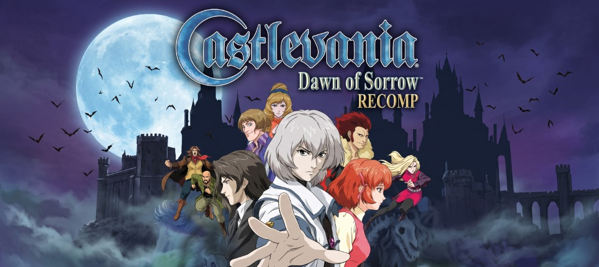

<p align="center">
  
</p>

# Castlevania: Dawn of Sorrow — NDS Static Recompiler

<p align="center">
  
  
  
  
  
</p>

---

## 📌 Visão Geral do Projeto

Este repositório contém a **recompilação estática nativa** de ***Castlevania: Dawn of Sorrow*** para Nintendo DS, baseada no framework [ndsrecomp](https://github.com/RetroPortingToolKit/ndsrecomp).

Diferente de emuladores tradicionais baseados em JIT ou interpretação contínua, este projeto extrai o código binário original (ARM946E-S e ARM7TDMI) e recompila todo o conjunto de instruções **diretamente para código C/C++ nativo ahead-of-time (AOT)**. O resultado é executado nativamente pela CPU do host (Linux x86_64 ou Android ARM64) com sobrecarga computacional praticamente nula.

---

## ⚡ Status Atual de Desempenho

O jogo foi completamente estabilizado e validado através de extensas sessões de jogabilidade interativa e baterias de testes automatizados com telemetria:

- **Taxa de Quadros**: **60.0 FPS constantes** sem engasgos ou quedas.
- **Tempo de Emulação de CPU**: Apenas **~6.35 ms por quadro** (dentro do orçamento de 16.66 ms de 60 Hz).
- **Folga Livre de CPU**: **>61.8% de tempo ocioso** por quadro.
- **Sobrecarga do Interpretador**: **Praticamente ZERO** (ARM9: 0.0014 ms/quadro, ARM7: 0.0016 ms/quadro). Mais de 99.9% de todo o código é executado nativamente.
- **Sessões Validadas**: Mais de **44.600 quadros consecutivos** jogados sem falhas, com leitura e gravação de savegame EEPROM (bateria) 100% funcionais.
- **Total de Funções Nativas Compiladas**: **31.985 funções C**.

### 📊 Comparativo de Otimização de Telemetria

| Métrica | Inicial | Otimizado (Atual) | Ganho |
| :--- | :--- | :--- | :--- |
| **Instruções Interpretadas no ARM7** | 1.053.746 | **90** | **-99.99%** |
| **Entradas no Interpretador ARM7** | 44.346 | **17** | **-99.96%** |
| **Instruções Interpretadas no ARM9** | 3.873 | **919** | **-76.3%** |
| **Tempo Médio de CPU por Quadro** | ~11.5 ms | **6.35 ms** | **-44.8%** |
| **Folga de CPU (Headroom)** | ~30% | **>61.8%** | **Excelente** |

---

## 🏗️ Arquitetura Multi-Banco

O jogo é dividido e compilado estaticamente em 6 bancos nativos:

1. **`castlevania_arm9`** (ARM9 Main, `0x02000000`): **16.736 funções nativas**, dividido em 10 shards paralelos para compilação relâmpago no GCC/Clang (< 2 minutos).
2. **`castlevania_arm9_itcm`** (ARM9 ITCM, `0x01FF8000`): **39 funções** responsáveis pelos loops de matemática e renderização rápida na memória ITCM.
3. **`castlevania_arm9_overlay_0000`** (Overlay 00, `0x0219E3E0`): **7.395 funções nativas** do motor permanente de gameplay (física de movimento, monstros, magias e armas).
4. **`castlevania_arm9_overlay_0001`** (Overlay 01, `0x02230A00`): **1.696 funções nativas** do módulo auxiliar permanente.
5. **`castlevania_arm7`** (ARM7 Base, `0x02380000`): **4.167 funções nativas** de gerenciamento de hardware e I/O.
6. **`castlevania_arm7_wram`** (ARM7 WRAM, `0x037F7E90`): **1.952 funções nativas** do driver de som e sincronia em memória rápida.

---

## 🎮 Como Compilar e Jogar no PC (Linux x86_64)

### Pré-requisitos
```bash
sudo apt update
sudo apt install build-essential cmake ninja-build libsdl2-dev python3 python3-pillow
```

### 1. Recompilação e Construção do Runner
Execute o script otimizado que processa todos os 6 bancos e compila o binário `nds_runner`:
```bash
./recompile_optimized.sh
```

### 2. Executando o Jogo
O jogo requer inicialização direta com FreeBIOS:
```bash
./runner/build-pc/nds_runner bios/ \
    --rom "Castlevania - Dawn of Sorrow .nds" \
    --config game.toml \
    --freebios \
    --boot direct \
    --interactive
```

### Controles
- **Controle USB / Bluetooth**: Mapeamento nativo automático (compatível com controles Xbox, PlayStation, Afterglow, 8BitDo, etc.).
- **Teclado**:
  - `Setas`: D-Pad
  - `Z` / `X`: Botões A / B
  - `S` / `A`: Botões X / Y
  - `Q` / `W`: Botões L / R
  - `Enter` / `Backspace`: Start / Select
  - `Tab`: Virtual Stylus (Touchscreen)
- **Mouse**: Clique na tela inferior para interação touchscreen rápida.

---

## 📱 Compilação para Android ARM64 (`arm64-v8a`)

Para gerar a biblioteca nativa `libnds_runner.so` para integração com o projeto Android (`recomp-ui`):

```bash
./build_android.sh /caminho/para/android-ndk
```

Exemplo com NDK instalado:
```bash
./build_android.sh ~/Android/Sdk/ndk/27.2.12479018
```

Os binários compilados serão gerados e instalados automaticamente em `android_output/lib/arm64-v8a/libnds_runner.so`.

---

## 🧪 Testes Automatizados e Telemetria

O projeto inclui ferramentas completas para validação headless e fuzzing automatizado:

```bash
python3 tools/title_smoke.py \
    --runner runner/build-pc/nds_runner \
    --bios bios/ \
    --rom "Castlevania - Dawn of Sorrow .nds" \
    --config game.toml \
    --freebios \
    --boot direct \
    --save-path "Castlevania - Dawn of Sorrow .sav" \
    --out smoke_test_results \
    --attract-vblanks 2000 \
    --fuzz-steps 15
```

---

## 🤝 Créditos e Agradecimentos

- **Projeto Original ndsrecomp**: Mantido por [RetroPortingToolkit](https://retroportingtoolkit.com/) e equipe do `ndsrecomp`.
- **Port & Otimizações**: Equipe [WINDROID-EMU](https://github.com/WINDROID-EMU).
- *Castlevania: Dawn of Sorrow* é uma marca registrada de **Konami Digital Entertainment**. Este projeto destina-se exclusivamente para fins de pesquisa e preservação, não incluindo ROMs protegidas por direitos autorais.
